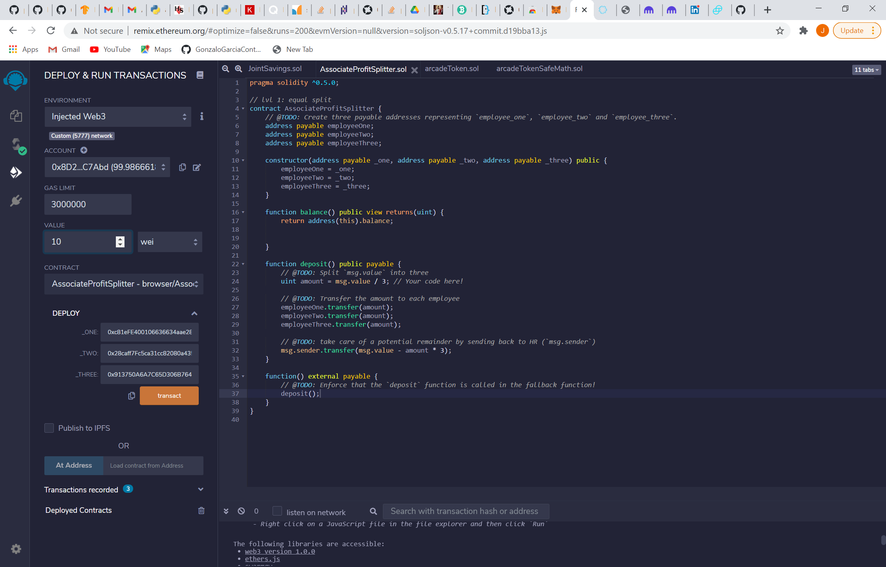
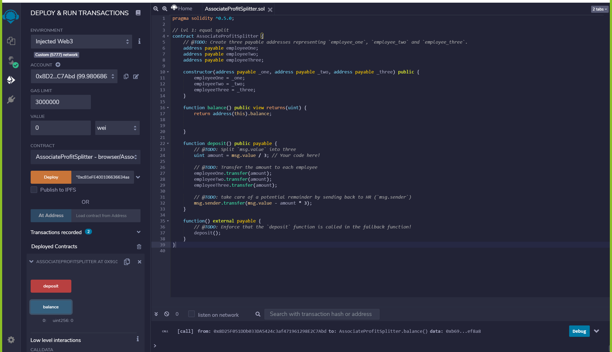
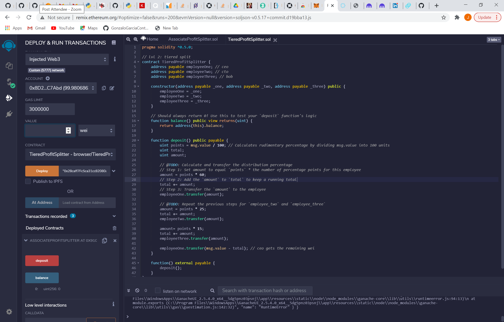
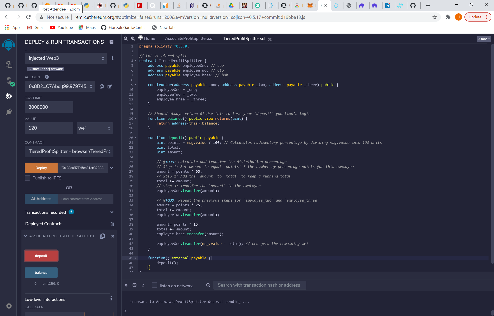

# Smart Contracts 
 

 This repo contains three smart contracts AssociateProfitSplitter, TieredProfitSplitter, DeferredEquityPlan.

 ##  AssociateProfitSplitter

 * Motivation: This contract accepts Ether into the contract and divide the Ether evenly among the associate level employees. This allows the Human Resources department to pay employees quickly and efficiently.
 * How to use: You must provide the address of three employees, specify the amount to transfer in the box VALUE, and then click on transact. The following images show haw the contract was deploy as well as the first transaction.
  

  

 ## TieredProfitSplitter

 * Motivation: this contract distributes different percentages of incoming Ether to employees at different tiers/levels. For example, the CEO gets paid 60%, CTO 25%, and Bob gets 15%.
 * How to use: You must provide the address of three employees, specify the amount to transfer in the box VALUE, so the contract can calculate the percentage for each one and then click on deposit. The following images show haw the contract was deploy as well as the first transaction.
  

  

 ## DeferredEquityPlan

 * Motivation: this contract models traditional company stock plans. This contract will automatically manage 1000 shares with an annual distribution of 250 over 4 years for a single employee; managing an employee's "deferred equity incentive plan" in which 1000 shares will be distributed over 4 years to the employee. 
 * How to use:
